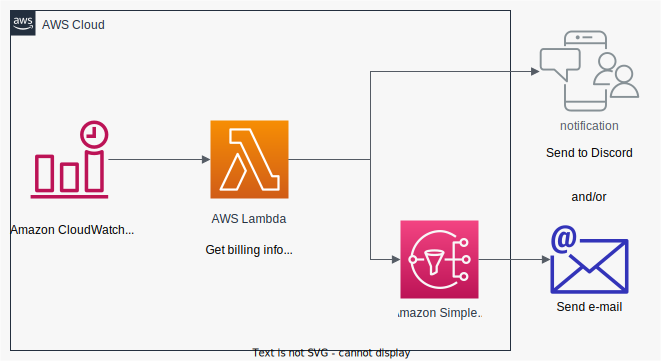

# AWS Daily Billing Notification Stack (AWS CDK)

This is an AWS daily billing notification sender stack.

Daily notification message will be sent to a Discord webhook url and/or an e-mail address
which tells you the total and per-service amount of the billing from 1st of month to today.


## Architecture



## How to deploy

### Webhook 

If you want to send message to the slack channel, please specify webhook url  through cdk context value.
```
cdk deploy --context webhook="<YOUR DISCORD WEBHOOK URL>"
```

### E-mail

If you want to send e-mail notification, please specify a mail address through cdk context value.
```
cdk deploy --context mail="<YOUR MAIL ADDRESS>"
```

If the e-mail address is specified, a subscription confirmation mail will be sent to your mail address.

Please confirm your mail address to subscribe topics.

### Both Webhook and E-mail

You can get notification to both the webhook url and the e-mail.

```
cdk deploy --context webhook="<YOUR DISCORD WEBHOOK URL>" --context mail="<YOUR MAIL ADDRESS>"
```

## References

- [AWSサービス毎の請求額を毎日Slackに通知してみた | Developers.IO](https://dev.classmethod.jp/articles/notify-slack-aws-billing/)
    