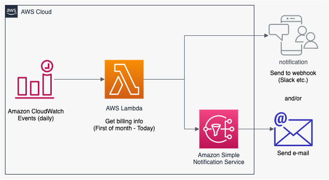

# AWS Daily Billing Notification Stack (AWS CDK)

This is an AWS daily billing notification sender stack
managed by [AWS CDK](https://docs.aws.amazon.com/cdk/api/latest/).

Daily notification message will be sent to a webhook url (slack etc.) and/or an e-mail address
which tells you the total and per-service amount of the billing from 1st of month to today.


## Architecture



## How to deploy

### Webhook 

If you want to send messeage to the slack channel, please specify webhook url  through cdk context value.
```
cdk deploy --context webhook="<YOUR WEBHOOK URL>"
```

### E-mail

If you want to send e-mail notification, please specify a mail address through cdk context value.
```
cdk deploy --context mail="<YOUR MAIL ADDRESS>"
```

If the e-mail address is specified, a subscription confirmation mail will be sent to your mail address.

Please confirm your mail address to subscribe topics.

### Both Webhook and E-mail

You can get notification to both the webhook url and the e-mail.
```
cdk deploy --context webhook="<YOUR WEBHOOK URL>" --context mail="<YOUR MAIL ADDRESS>"
```

## References

- [AWSサービス毎の請求額を毎日Slackに通知してみた | Developers.IO](https://dev.classmethod.jp/articles/notify-slack-aws-billing/)
    
    Lambdaでの請求情報の取得方法を参考にさせていただきました！

## CDK useful commands

 * `npm run build`   compile typescript to js
 * `npm run watch`   watch for changes and compile
 * `npm run test`    perform the jest unit tests
 * `cdk deploy`      deploy this stack to your default AWS account/region
 * `cdk diff`        compare deployed stack with current state
 * `cdk synth`       emits the synthesized CloudFormation template
